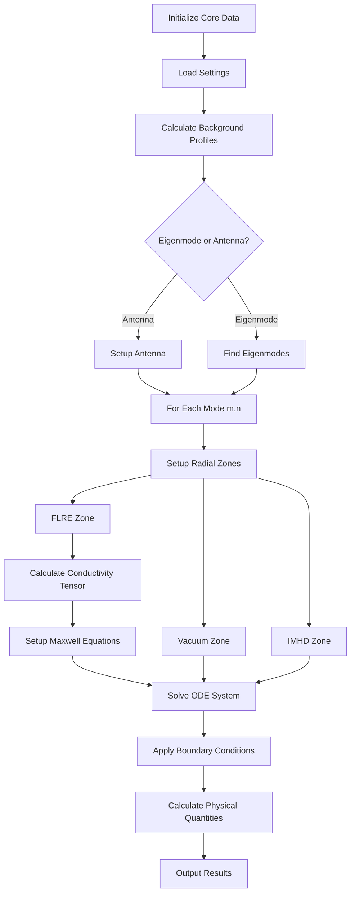

# KiLCA Documentation

## Overview

KiLCA (Kinetic Linear Plasma Response Solver - Cylindrical) is a scientific computing framework for modeling plasma response to external magnetic perturbations in fusion plasmas. It solves the linearized kinetic plasma equations in cylindrical geometry including Finite Larmor Radius (FLR) effects.

## Mathematical Foundation

### Core Physics Model

KiLCA solves the linearized Vlasov-Maxwell system for plasma waves in cylindrical geometry $(r, \theta, z)$:

$$\frac{\partial f_s}{\partial t} + \vec{v} \cdot \nabla f_s + \frac{q_s}{m_s}(\vec{E} + \vec{v} \times \vec{B}) \cdot \nabla_v f_s = 0$$

where:
- $f_s$ is the distribution function for species $s$
- $q_s$, $m_s$ are the charge and mass
- $\vec{E}$, $\vec{B}$ are the electromagnetic fields

### Perturbation Analysis

The code assumes perturbations of the form:

$$\tilde{A}(r,\theta,z,t) = A(r) \exp(i m \theta + i n z - i \omega t)$$

where:
- $m$ is the poloidal mode number
- $n$ is the toroidal mode number  
- $\omega$ is the complex frequency

### Finite Larmor Radius Effects

The conductivity tensor includes FLR effects through Bessel function expansions:

$$\sigma_{ij} = \sum_{l=-\infty}^{\infty} \sum_s \frac{n_s q_s^2}{m_s} \int d^3v \frac{v_i L_j f_{0s}}{k_\parallel v_\parallel - \omega + l \Omega_s}$$

where $L_j$ are operators containing Bessel functions $J_l(k_\perp \rho_s)$ with Larmor radius $\rho_s$.

## Architecture Overview

### Core Components

```
KiLCA/
├── core/           # Core data structures and settings
├── background/     # Background plasma profiles
├── mode/           # Mode analysis and zone management
├── flre/           # Finite Larmor Radius Effects
│   ├── conductivity/   # Conductivity tensor calculations
│   ├── maxwell_eqs/    # Maxwell equations system
│   ├── dispersion/     # Dispersion relations
│   └── quants/         # Physical quantities
├── solver/         # ODE/PDE solvers
├── antenna/        # Antenna modeling
├── interface/      # External code interfaces
├── math/           # Mathematical libraries
└── fortran_modules/# Fortran translation modules
```

### Key Classes/Modules

1. **`core_data`**: Central data structure containing all simulation data
2. **`background`**: Background plasma profiles (density, temperature, etc.)
3. **`mode_data`**: Mode-specific data for each $(m,n)$ perturbation
4. **`zone`**: Radial zone management (FLRE, vacuum, IMHD regions)
5. **`flre_zone`**: Plasma physics with FLR effects
6. **`maxwell_eqs_data`**: Maxwell equations in cylindrical coordinates

## Algorithm Flowchart



## Numerical Methods

### 1. Conductivity Tensor Calculation

- **Method**: Adaptive quadrature with resonance handling
- **Key Challenge**: Singularities at cyclotron resonances $\omega = k_\parallel v_\parallel + l\Omega_s$
- **Solution**: Landau prescription with adaptive grid refinement near resonances

### 2. Maxwell Equations System

The electromagnetic fields satisfy:

$$\nabla \times \vec{E} = i\omega \vec{B}$$
$$\nabla \times \vec{B} = -i\omega\epsilon_0\mu_0 \vec{E} + \mu_0 \vec{J}$$

Reduced to a system of ODEs in cylindrical coordinates:

$$\frac{d}{dr}\vec{U} = \mathbf{M}(r)\vec{U}$$

where $\vec{U} = [E_r, E_\theta, E_z, B_r, B_\theta, B_z]^T$

### 3. ODE Integration

- **Method**: 4th-order Runge-Kutta (RK4) 
- **Alternative**: CVODE for stiff problems
- **Orthogonalization**: QR decomposition to maintain linear independence

### 4. Eigenmode Finding

- **Method**: Argument principle with Newton iterations
- **Algorithm**: 
  1. Calculate winding number around search region
  2. Adaptive rectangular subdivision
  3. Newton-Raphson iterations from grid points
  4. Filter duplicate roots

### 5. Zone Stitching

Different physics regions are connected via:
- Continuity of tangential $\vec{E}$ and $\vec{B}$
- Jump conditions for antenna current sheets

## Key Physics Models

### 1. Background Equilibrium

- **Profiles**: $n(r)$, $T_i(r)$, $T_e(r)$, $q(r)$, $B(r)$
- **Distribution**: Maxwellian or bi-Maxwellian
- **Flows**: Toroidal and poloidal rotation

### 2. Collision Models

- **Electron-ion**: Coulomb collisions
- **Like-particle**: Self-collisions
- **Effective**: Krook collision operator

### 3. Dispersion Relations

Local dispersion relation for validation:

$$D(\omega, k_\perp, k_\parallel) = \det[\mathbf{K} - n^2\mathbf{I} + n^2\hat{k}\hat{k}] = 0$$

where $\mathbf{K} = \mathbf{I} + \frac{i}{\omega\epsilon_0}\boldsymbol{\sigma}$

## Important Parameters

### Numerical Parameters

| Parameter | Description | Typical Value |
|-----------|-------------|---------------|
| `flre_order` | FLR expansion order | 1-2 |
| `Nmax` | Maximum cyclotron harmonic | 3-5 |
| `eps_res` | Resonance resolution | $10^{-6}$ |
| `dr_out` | Grid spacing outside resonance | 0.01 |
| `dr_res` | Grid spacing in resonance | 0.001 |

### Physical Parameters

| Parameter | Description | Units |
|-----------|-------------|-------|
| $\omega$ | Wave frequency | rad/s |
| $k_\perp$ | Perpendicular wavenumber | m$^{-1}$ |
| $k_\parallel$ | Parallel wavenumber | m$^{-1}$ |
| $\rho_i$ | Ion Larmor radius | m |
| $\beta$ | Plasma beta | - |

## Fortran Module Structure

The ongoing Fortran translation follows this hierarchy:

```
kilca_types_m           # Type definitions
├── kilca_constants_m   # Physical constants  
├── kilca_settings_m    # Configuration
├── kilca_background_m  # Background profiles
├── kilca_mode_m        # Mode analysis
├── kilca_solver_m      # ODE solvers
├── kilca_conductivity_m # Conductivity tensor
├── kilca_maxwell_m     # Maxwell equations
├── kilca_physics_m     # Physics models
└── kilca_zerofind_m    # Root finding
```

## Performance Considerations

1. **Memory**: Conductivity matrices scale as $O(N_r \times N_{harm}^2)$
2. **Computation**: Dominated by conductivity integrals and matrix operations
3. **Parallelization**: Mode-level parallelism (each $(m,n)$ independent)
4. **Optimization**: Adaptive grids concentrate points near resonances

## Usage Workflow

1. **Setup**: Define plasma equilibrium and profiles
2. **Configure**: Set numerical parameters and physics models
3. **Execute**: Run for specific modes or antenna configuration
4. **Analyze**: Extract power absorption, current drive, transport

## References

- Finite Larmor Radius theory: Stix, "Waves in Plasmas" (1992)
- Cylindrical kinetic codes: Jaeger et al., Phys. Plasmas (2001)
- Numerical methods: Brambilla, "Kinetic Theory of Plasma Waves" (1998)